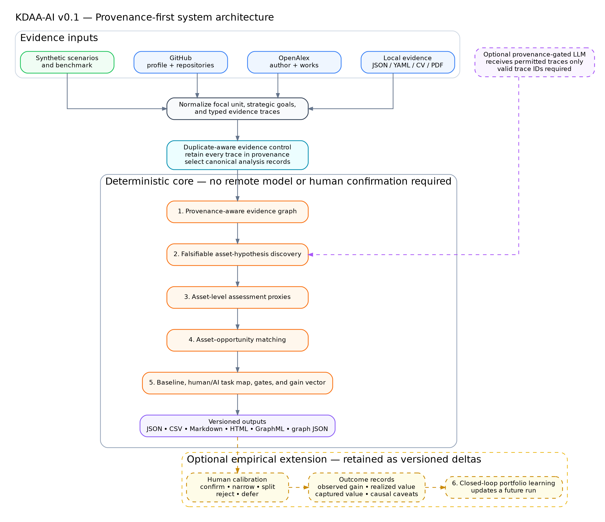
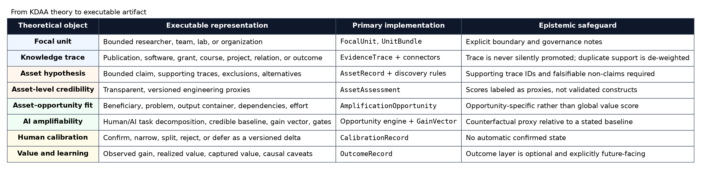
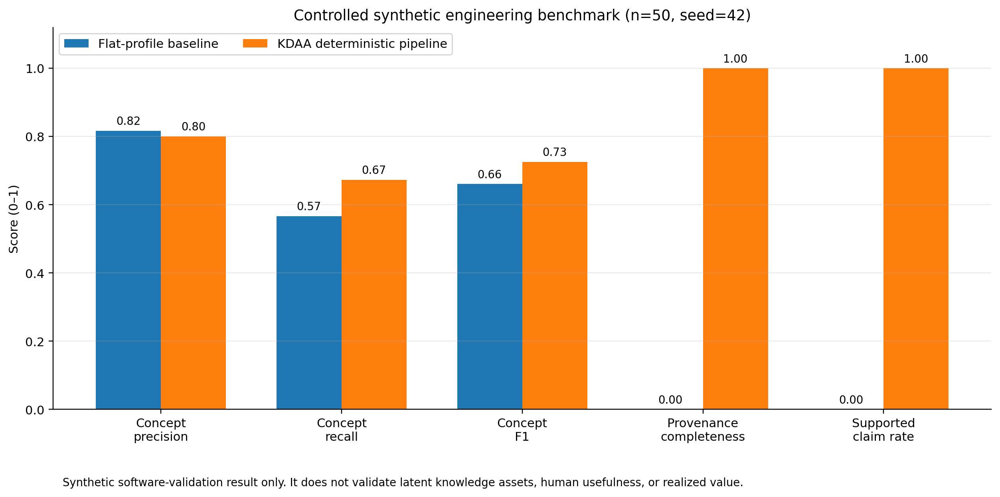
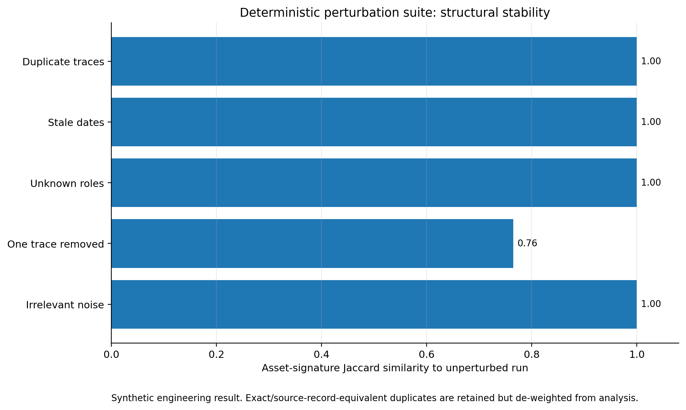
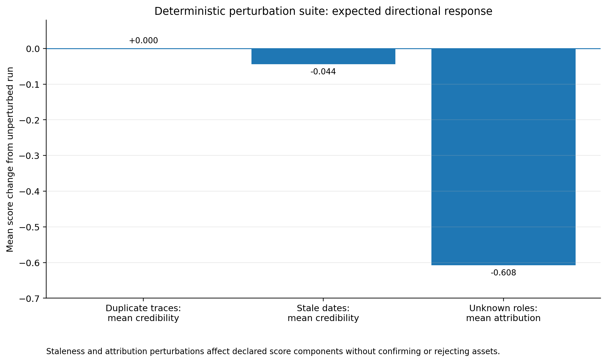
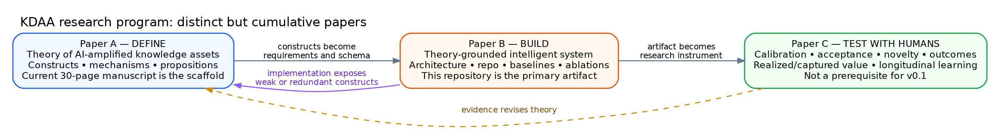

# KDAA-AI

[](https://github.com/omicsai-lab/kdaa-ai/actions/workflows/ci.yml)
[](https://www.python.org/)
[](LICENSE)
[](CHANGELOG.md)

**KDAA-AI** is a provenance-aware research platform for **Knowledge Asset Discovery, Assessment, and Amplification**. It converts heterogeneous evidence traces into falsifiable asset hypotheses, transparent assessment proxies, and opportunity-specific human–AI amplification plans.

The repository is the first executable instantiation of the theory developed in:

> *AI-Amplified Knowledge Assets: A Multilevel Framework for Discovery, Assessment, Amplification, and Value Realization*.

It is designed as the primary artifact for a future design-science / intelligent-systems paper, while keeping human calibration and longitudinal outcome validation as a separate empirical stage.

> [!IMPORTANT]
> **KDAA-AI does not certify expertise, ownership, employability, scientific merit, or future value.** A publication, repository, grant, title, or collaboration is a **trace**, not automatically a knowledge asset. Every system output remains a hypothesis or provisional record unless a responsible human calibration process changes its epistemic state.



## What v0.1 does

KDAA-AI currently provides a complete, local-first pipeline that can run without a remote language model and without waiting for human confirmation:

1. Defines a bounded **focal unit**: researcher, team, laboratory, department, firm, nonprofit, public institution, or other unit.
2. Normalizes typed **evidence traces** from local files, CV/PDF documents, OpenAlex, GitHub, or clearly labeled synthetic data. Exact or source-record-equivalent duplicates are retained in provenance but excluded from analytical support counts.
3. Builds a provenance graph connecting the focal unit, traces, contributors, projects, and analytical records, including duplicate-to-canonical trace relations when detected.
4. Generates bounded **asset hypotheses** with supporting trace IDs, exclusions, alternative explanations, dependencies, and ownership caveats.
5. Produces transparent **asset-level assessment proxies** for evidence strength, attribution, maturity, distinctiveness, tacitness, transferability, dependency, decay, appropriation, AI interfaceability, privacy, and overall credibility.
6. Matches assets to concrete opportunities with a beneficiary, problem, output container, credible baseline, human/AI task division, verification gates, gain vector, readiness, and governance risk.
7. Exports a machine-readable and human-readable portfolio in JSON, CSV, Markdown, HTML, GraphML, and graph JSON.
8. Preserves optional calibration and outcome records as versioned deltas rather than overwriting the original AI-only map.

The five reusable output containers are built into the opportunity catalog:

- repository;
- living document;
- structured knowledge base;
- deployable product;
- public content.

The catalog also includes research-specific pathways for a methods/design-science paper and a grant-ready program.

## What v0.1 deliberately does not claim

- The proxy scores are not validated psychometric or organizational constructs.
- Synthetic benchmark performance is not evidence that real latent knowledge assets are valid.
- Public data do not establish contribution ownership, tacit capability, current availability, or consent.
- Exact duplicate control does not establish source independence or eliminate semantic near-duplicates.
- The optional LLM mode does not turn plausible text into evidence; proposed claims must cite valid trace IDs.
- Human calibration is not required to run the MVP, but high-impact claims should not be treated as confirmed without it.
- Realized and captured value require later outcome data and a defensible counterfactual design.

## Theory-to-artifact traceability



The implementation preserves the paper's layered ontology:

```text
focal unit
  └── observable knowledge traces
        └── falsifiable asset hypotheses
              └── asset-level assessment
                    └── asset–opportunity matches
                          └── governed amplification workflows
                                └── optional outcomes and closed-loop learning
```

Detailed mappings are documented in [Theory to system](docs/theory_to_system.md), [Traceability matrix](docs/traceability_matrix.md), and [Core data model](docs/ontology_and_schema.md). Release-level claims and checks are summarized in [Release notes](RELEASE_NOTES.md) and the [Release checklist](docs/release_checklist.md).

## Quick start

### 1. Install

```bash
git clone https://github.com/omicsai-lab/kdaa-ai.git
cd kdaa-ai
python -m venv .venv
source .venv/bin/activate              # Windows: .venv\Scripts\activate
python -m pip install --upgrade pip
pip install -e ".[app,dev]"
```

Core use without the Streamlit interface:

```bash
pip install -e ".[dev]"
```

A minimal programmatic example is available in [`examples/basic_usage.py`](examples/basic_usage.py):

```bash
python examples/basic_usage.py
```

### 2. Run a fully synthetic demonstration

```bash
kdaa demo --scenario researcher --output results/demo
```

Collective focal-unit examples:

```bash
kdaa demo --scenario lab  --output results/demo-lab
kdaa demo --scenario team --output results/demo-team
```

The default researcher scenario produces, in the current release:

- 21 synthetic evidence traces;
- 32 provisional/hypothesized asset records;
- 7 opportunity records;
- 0 automatically confirmed assets.

Open `results/demo/portfolio_report.html` or `results/demo/portfolio_report.md` after the run.

### 3. Run the controlled synthetic benchmark

```bash
kdaa benchmark --n-units 50 --seed 42 --output results/benchmark
```



Current committed result:

| Metric | Flat-profile baseline | KDAA deterministic pipeline |
|---|---:|---:|
| Concept precision | 0.817 | 0.801 |
| Concept recall | 0.567 | 0.673 |
| Concept F1 | 0.661 | 0.726 |
| Claim-level provenance completeness | 0.000 | 1.000 |
| Supported-claim rate | 0.000 | 1.000 |
| Confirmed without human calibration | not applicable | 0.000 |
| Determinism across repeated runs | not applicable | 1.000 |

These are **engineering smoke-test metrics on generated cases**. See [Evaluation protocol](docs/evaluation_protocol.md) before interpreting them.

### 4. Run the deterministic perturbation suite

```bash
kdaa stress-test --output results/robustness
```





The committed suite tests exact duplicates, stale dates, unknown contribution roles, a removed trace, and irrelevant administrative noise. In v0.1, exact duplicates and irrelevant noise leave the asset signature unchanged; stale dates reduce the credibility proxy; unknown roles reduce attribution confidence; and no case auto-confirms an asset. The suite is still synthetic engineering validation, not evidence of human usefulness or construct validity.

## Analyze your own evidence bundle

Generate a JSON schema:

```bash
kdaa schema --output data/schema/unit_bundle.schema.json
```

Analyze a local bundle:

```bash
kdaa analyze data/demo/synthetic_researcher.json --output results/my-run
```

Parse a local CV-like PDF or text file into a conservative, sensitive evidence bundle:

```bash
kdaa ingest-cv researcher_cv.pdf \
  --unit-id unit:researcher \
  --unit-name "Researcher Name" \
  --institution "Georgetown University" \
  --output data/cv_bundle.json

kdaa analyze data/cv_bundle.json --output results/cv-run
```

The parser is heuristic. Review section segmentation, identity, contribution roles, privacy, and redistribution rights before analysis or sharing.

A `UnitBundle` contains:

- one `FocalUnit`;
- zero or more strategic goals;
- one or more typed `EvidenceTrace` records;
- optional metadata.

The complete model is shown below and described in [Ontology and schema](docs/ontology_and_schema.md).


## Public-data connectors

### OpenAlex

```bash
export OPENALEX_API_KEY="..."
export OPENALEX_EMAIL="you@example.edu"     # optional identification
kdaa fetch-openalex "https://orcid.org/0000-0000-0000-0000" \
  --max-works 50 \
  --output data/openalex_bundle.json
```

The connector can resolve an OpenAlex author ID, an ORCID identifier, or a name. **Name resolution must be reviewed for identity ambiguity.** Production use should provide a free OpenAlex API key; only limited keyless demo access may be available. See the official OpenAlex API documentation.

### GitHub

```bash
export GITHUB_TOKEN="..."                   # strongly recommended
kdaa fetch-github omicsai-lab \
  --max-repos 100 \
  --output data/github_bundle.json
```

A token is optional in the code but strongly recommended because unauthenticated REST requests have a much lower rate limit. Repository presence does not establish authorship of every line, scientific validity, or ownership of dependencies.

### Merge sources

```bash
kdaa merge \
  data/openalex_bundle.json \
  data/github_bundle.json \
  data/local_bundle.yaml \
  --output data/merged_bundle.json

kdaa analyze data/merged_bundle.json --output results/merged-run
```

## Execution modes

### Deterministic mode — default

```yaml
mode: deterministic
llm:
  enabled: false
```

This mode uses declared ontology terms, provenance rules, transparent proxy formulas, and an opportunity template catalog. It is the default for reproducibility and the synthetic benchmark.

### Hybrid mode — optional

```yaml
mode: hybrid
llm:
  enabled: true
  provider: openai_compatible
  base_url: https://api.openai.com/v1
  model: YOUR_MODEL_NAME
  api_key_env: KDAA_LLM_API_KEY
```

```bash
export KDAA_LLM_API_KEY="..."
kdaa analyze data/merged_bundle.json \
  --config configs/your_hybrid_config.yaml \
  --output results/hybrid-run
```

The LLM receives only permitted evidence. Every suggested asset must cite trace IDs that exist in the input bundle. Invalid or unsupported outputs are rejected by model validation and provenance gates. Sensitive traces are excluded unless explicitly enabled.

### LLM-only mode

Supported for experiments, but not recommended as the primary scientific baseline. It removes the deterministic discovery layer while retaining data-model and provenance validation.

## Streamlit research interface

```bash
streamlit run app/streamlit_app.py
```

The interface supports:

- synthetic and uploaded UnitBundle inputs;
- deterministic, hybrid, or LLM mode selection;
- asset and opportunity inspection;
- evidence-link inspection;
- a simplified provenance graph;
- optional calibration records;
- downloadable JSON, CSV, Markdown, HTML, and graph exports.

The app is a research interface, not a production HR, promotion, funding, or surveillance system.

## FastAPI service

```bash
uvicorn kdaa.api:app --reload
```

Interactive API documentation is available at `/docs`. Main endpoints:

| Method | Endpoint | Purpose |
|---|---|---|
| `GET` | `/health` | Service health and version |
| `GET` | `/v1/schema/unit-bundle` | Input JSON schema |
| `POST` | `/v1/analyze` | Run the KDAA pipeline on a UnitBundle |
| `POST` | `/v1/demo` | Run the synthetic researcher scenario |
| `POST` | `/v1/calibrate` | Apply optional calibration deltas |

See [API and CLI reference](docs/api_and_cli.md).

## Output contract

A completed run writes:

```text
results/<run>/
├── analysis_run.json          # complete versioned analytical record
├── run_manifest.json          # input/config digests and execution metadata
├── asset_portfolio.csv        # flat asset assessment table
├── opportunities.csv          # opportunity ranking and task allocation
├── portfolio_report.md        # human-readable research report
├── portfolio_report.html      # styled standalone report
├── provenance_graph.graphml   # graph-tool / Gephi compatible
└── provenance_graph.json      # node-link JSON
```

No export should be shared before reviewing identity resolution, source licenses, contribution attribution, sensitive traces, and provisional claims.

## Repository architecture

```text
src/kdaa/
├── ingestion/       # local/CV, OpenAlex, GitHub, synthetic evidence, and trace de-duplication
├── discovery/       # feature extraction, provenance graph, rules, optional LLM
├── assessment/      # transparent asset-level proxy scoring
├── amplification/   # five-container opportunity catalog and matching
├── evaluation/      # synthetic generator, baseline, benchmark, and perturbation suite
├── providers/       # optional OpenAI-compatible JSON provider
├── resources/       # ontology and report templates
├── api.py           # FastAPI interface
├── cli.py           # Typer command line
├── lifecycle.py     # optional calibration and outcome deltas
├── models.py        # strict Pydantic domain model
├── pipeline.py      # end-to-end orchestration
└── report.py        # versioned exports
```

See [Architecture](docs/architecture.md) and [Scoring reference](docs/scoring_reference.md).

## Research program and publication boundaries



- **Paper A — Define:** theoretical constructs, mechanisms, propositions, boundary conditions, and value capture. The existing 30-page manuscript is the working scaffold. The repo may appear only as a bounded computational instantiation.
- **Paper B — Build:** the executable artifact, design requirements, architecture, baselines, ablations, provenance guarantees, reproducibility, and controlled evaluation. This repository is the main empirical object.
- **Paper C — Test with humans:** calibration, acceptance, novelty, usefulness, attribution, realized/captured value, and longitudinal learning. This is explicitly not required for v0.1.

The boundaries are developed in [Paper B scope](docs/paper_b_scope.md), [Paper A integration](docs/paper_a_integration.md), and [Paper C human loop](docs/paper_c_human_loop.md).

## Reproducibility

```bash
make test
make demo
make benchmark
make stress-test
make figures
```

Or run the release check and build a clean source archive plus wheel:

```bash
python scripts/check_release.py
make package
```

The release check validates imports, schemas, deterministic output behavior, tests, demo outputs, benchmark and perturbation outputs, local documentation links, diagrams, and absence of common secret patterns. The packaging step creates a checksummed source ZIP with an internal file manifest and a Python wheel in `dist/`.

Docker:

```bash
cp .env.example .env
docker compose up --build api
```

See [Reproducibility](docs/reproducibility.md).

## Governance and responsible use

KDAA-AI can expose sensitive inferences about individuals and groups even when the source traces are public. Use therefore requires:

- a legitimate purpose and a clearly bounded focal unit;
- source-law, license, privacy, and institutional-policy review;
- contribution and collective-ownership safeguards;
- explicit separation between observation, inference, calibration, and outcome;
- a mechanism for correction, rejection, and appeal;
- prohibition on covert surveillance or automated high-stakes decisions;
- retention of negative evidence and rejected hypotheses;
- disclosure of material AI assistance in research outputs.

Read [Data governance](docs/data_governance.md), [Limitations](docs/limitations.md), [AI use disclosure](AI_USE_DISCLOSURE.md), and [Security policy](SECURITY.md).

## Development status

Version `0.1.0` is a **research alpha**. The core deterministic pipeline, conservative duplicate control, connectors with mocked tests, exports, API, lifecycle records, synthetic benchmark, perturbation suite, and documentation are implemented. The following remain future work:

- identity/entity resolution beyond basic connector matching;
- semantic/cross-source duplicate resolution and stronger contribution-attribution models;
- ontology learning without losing auditability;
- real-world benchmark construction;
- blinded human evaluation;
- outcome and counterfactual evaluation;
- access control, encryption, and production deployment hardening;
- validated measurement models for theoretical constructs.

See [Roadmap](docs/roadmap.md).

## Citation

Until a paper and archived software release receive final bibliographic identifiers, cite the repository using [`CITATION.cff`](CITATION.cff):

```text
Li, James. (2026). KDAA-AI: Knowledge Asset Discovery, Assessment,
and Amplification (Version 0.1.0) [Computer software]. OmicsAI Lab,
Georgetown University. https://github.com/omicsai-lab/kdaa-ai
```

## Authorship and AI assistance

The intellectual direction, focal problem, theory–artifact mapping, research boundaries, and release decisions are the responsibility of the named author and maintainers. Generative AI and coding assistance were used materially in drafting, implementation, testing, documentation, and quality control. All outputs remain subject to human authorship, source verification, software testing, and journal-specific disclosure policies. See [`AI_USE_DISCLOSURE.md`](AI_USE_DISCLOSURE.md).

## License

Code and original documentation are released under the [MIT License](LICENSE). Synthetic example data are marked `CC0-1.0` inside their records. Public-source records retain their original source terms and must be reviewed before redistribution.
