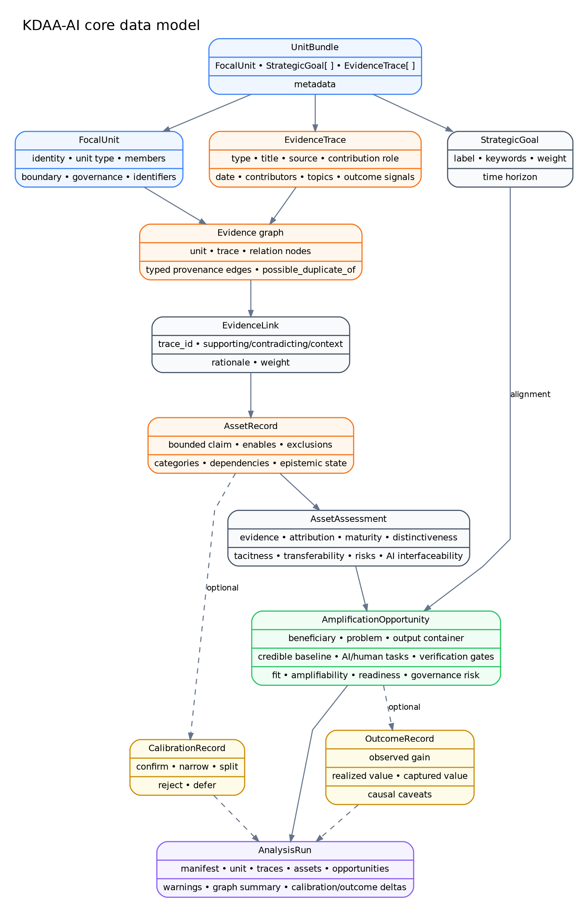

# Ontology and schema

## Layered ontology

KDAA-AI separates five levels that are often collapsed in profiles and recommendation systems:

1. **Unit:** the bounded actor under analysis.
2. **Trace:** observable evidence associated with that unit.
3. **Asset claim:** a falsifiable inference supported or challenged by traces.
4. **Opportunity:** a concrete problem/deployment path matched to assets.
5. **Outcome:** observed consequences and value allocation.



## Input schema: `UnitBundle`

```json
{
  "unit": {
    "id": "unit:example",
    "name": "Example Unit",
    "unit_type": "researcher",
    "description": "...",
    "boundary_notes": "...",
    "governance_notes": "...",
    "is_synthetic": false
  },
  "goals": [
    {
      "id": "goal-1",
      "label": "Create reusable outputs",
      "keywords": ["software", "paper"],
      "weight": 1.0,
      "horizon_months": 12
    }
  ],
  "traces": [
    {
      "id": "trace-1",
      "unit_id": "unit:example",
      "trace_type": "software_repository",
      "title": "Example repository",
      "source_kind": "github",
      "contribution_role": "originator",
      "keywords": ["reproducibility"],
      "sensitive": false
    }
  ],
  "metadata": {}
}
```

All trace IDs must be unique and every trace must reference the same unit ID as the bundle.

Generate the authoritative JSON schema:

```bash
kdaa schema --output data/schema/unit_bundle.schema.json
```

## Trace types

| Enum | Typical evidence |
|---|---|
| `publication` | journal or conference output |
| `software_repository` | code, package, application, workflow |
| `dataset` | reusable data resource or benchmark |
| `grant` | proposal or funded program trace |
| `project` | bounded project or implementation |
| `protocol` | reusable scientific or operational procedure |
| `course` | curriculum and teaching artifact |
| `talk` | seminar, tutorial, invited presentation |
| `patent` | codified intellectual property |
| `employment` | formal role; weak without deliverables |
| `award` | recognition; weak as direct capability evidence |
| `collaboration` | relation or network trace |
| `document` | manuscript, report, book, playbook, SOP |
| `outcome` | documented result or impact signal |
| `other` | source not represented above |

## Contribution roles

Role is retained because evidence about an output is not equivalent to evidence of the focal unit's contribution. Current roles are:

`originator`, `lead`, `implementer`, `supervisor`, `advisor`, `contributor`, `participant`, and `unknown`.

The ontology assigns configurable weights to these roles. The weights are engineering defaults and should be examined for each domain.

## Concept ontology

`src/kdaa/resources/ontology.yaml` declares concepts, labels, groups, and lexical terms. v0.1 includes concepts spanning:

- AI/ML, deep learning, transformers, generative and agentic AI, RAG;
- causal inference, statistical and survival methods;
- clinical trials and biomedical omics domains;
- knowledge management and information systems;
- research computing, software/data engineering, reproducibility;
- scientific writing, grants, teaching, mentoring, collaboration, consulting, and product development.

The ontology is deliberately inspectable. It is not claimed to be complete, unbiased, or portable without adaptation.

## Epistemic states

| State | Meaning |
|---|---|
| `hypothesis` | system-generated claim below the provisional threshold or awaiting review |
| `provisional` | evidence proxy exceeds the configured threshold, but the claim is not human-confirmed |
| `confirmed` | a calibration record explicitly confirms the bounded claim |
| `narrowed` | human review accepts a more limited claim |
| `split` | the original record should be separated into multiple claims |
| `rejected` | the claim is not supported or is misattributed |
| `retired` | formerly useful record no longer active |

## Evidence links

A link has a trace ID, role, relation, rationale, and weight. Roles include:

- `supporting`;
- `contradicting`;
- `context`;
- `missing`.

Contradicting and missing evidence are part of the data model even though v0.1 deterministic discovery mainly creates supporting links. Later calibration and empirical work should make negative evidence more substantive.

## Versioning

Asset records carry a `version`. Calibration increments the version while preserving the original run and appended calibration records. Run manifests store:

- package version;
- input digest;
- configuration digest;
- random seed;
- execution mode;
- optional model identity;
- run notes and timestamp.
